# 基于 U-KAN 的医学图像分割算法复现与注意力增强改进研究

**课程方向**：方向（一）复现任意人工智能算法  
**项目 GitHub**：[https://github.com/Simon-Tisa/AI_CourseWork.git](https://github.com/Simon-Tisa/AI_CourseWork.git)  
**实验代码分支**：`course-paper-ukan`  
**作者**：蔡雪峰  
**日期**：2026 年 6 月

## 来源说明

本文围绕 U-KAN 在二维医学图像分割任务中的复现与改进展开。算法来源主要包括 U-KAN 论文与官方开源项目、Kolmogorov-Arnold Network（KAN）论文及 pykan 项目、U-Net 经典医学图像分割框架、通道-空间注意力机制相关论文，以及 BUSI 与 CVC-ClinicDB 两个公开医学图像分割数据集。项目代码为课程论文重新组织的 PyTorch 工程，未直接复制官方训练脚本；官方源码主要用于核对模型结构、训练超参数和结果解释。

本项目使用的全部实验指标来自本地训练和 `evaluate.py` 脚本评估，未由大语言模型生成或改写。本文写作、结构组织、语言润色和图表说明使用 OpenAI Codex 辅助完成；实验方案、训练数据、运行截图、结果表格和结论均基于本地工程记录。原始手绘草图文件为 `fig-PPT手绘.pdf`，本文进一步绘制了规范化 KAN 原理图、U-KAN 结构图、Attention-U-KAN 模块图和实验流程图，并在每幅图下标明来源。

## 摘要

医学图像分割需要在有限标注数据条件下准确定位病灶或器官边界。传统 U-Net 结构具有清晰的编码器-解码器和跳跃连接，但中高层非线性表达通常依赖卷积或普通 MLP。U-KAN 将 Kolmogorov-Arnold Network 中“边上可学习一维函数”的思想引入 U 型分割网络，在 token 化特征上使用 KANBlock 建模复杂非线性关系。本文选择课程方向（一）“复现任意人工智能算法”，在本地 PyTorch 环境中复现 U-KAN 的医学图像分割流程，并在此基础上尝试加入轻量通道-空间注意力模块，构建 Attention-U-KAN。

实验使用 BUSI 乳腺超声数据集和 CVC-ClinicDB 结肠镜息肉数据集，统一进行数据整理、固定随机划分、训练、评估和可视化。对比模型包括传统 U-Net、U-KAN(no-KAN)、U-KAN 和 Attention-U-KAN。结果显示，U-KAN 在 BUSI 上取得 IoU=0.6874、Dice=0.8147，相对 no-KAN 提升 IoU 0.0388，相对 U-Net 提升 IoU 0.0504；在 CVC 上取得 IoU=0.7874、Dice=0.8810，也为主实验中最佳结果。补充随机种子实验表明，BUSI 上 KAN 模块收益不是单一 seed 的偶然现象；CVC 继续训练实验显示，当前 U-KAN 主模型在 100 epoch 后基本达到平台期。Attention-U-KAN 未稳定超过原始 U-KAN，说明简单注意力插入并不必然提升 KAN 分割网络。本文最终形成完整代码仓库、README、数据整理脚本、训练日志、结果表格、预测可视化和课程论文成稿。

**关键词**：医学图像分割；U-KAN；Kolmogorov-Arnold Network；U-Net；注意力机制；算法复现

## 1 引言

医学图像分割是计算机辅助诊断中的基础任务之一。对于乳腺超声、结肠镜等图像，准确分割病灶区域可以辅助医生估计病灶大小、形态和边界，为后续诊断和随访提供量化依据。与自然图像相比，医学图像常具有样本数量有限、标注成本高、边界模糊、目标面积小和图像噪声强等特点，因此模型不仅需要较强的局部纹理提取能力，也需要在中高层语义上表达复杂非线性关系。

U-Net 是医学图像分割中最经典的卷积网络结构。它通过编码器提取多尺度语义特征，通过解码器逐步恢复空间分辨率，并利用跳跃连接弥补上采样过程中的细节损失。此类结构简单、稳定、易训练，但在复杂组织边界和弱对比目标上仍可能受到卷积感受野和普通非线性变换的限制。KAN 提供了另一种建模思路：传统 MLP 通常在节点上放置固定激活函数，而 KAN 将可学习的一维函数放在网络边上，并用样条基函数进行参数化。这种表示方式为神经网络的非线性建模提供了新的可解释结构。

U-KAN 的核心动机是把 KAN 的非线性表达能力嵌入 U 型医学图像分割架构。它保留 U-Net 的局部卷积编码和跳跃连接，同时在更高层的 token 化特征上使用 KANBlock 替代普通 MLP，以增强全局语义和非线性映射能力。本文选择 U-KAN 作为复现对象，是因为它既符合“复现一个人工智能算法”的课程要求，又能自然扩展出医学图像分割数据整理、模型消融、对比实验、可视化和工程化复现等加分项。

本文的主要工作包括：第一，重新组织 U-KAN 分割工程，完成 BUSI 与 CVC 数据集预处理、固定划分、训练和评估；第二，实现 U-Net、U-KAN(no-KAN)、U-KAN 和 Attention-U-KAN 四类模型，形成主实验矩阵；第三，围绕训练曲线异常和 CVC 收敛性疑问设计补充实验；第四，生成完整图表、运行截图、README 和论文正文，从实验事实出发讨论复现效果与局限。

## 2 算法原理与模型构建

### 2.1 KAN 与 MLP 的差异

MLP 的基本单元通常可以写为：`y = W σ(x) + b`。其中 `σ` 是 ReLU、GELU、SiLU 等固定激活函数，网络学习的主要是线性权重 `W`。KAN 的思路不同，它把每条边上的映射定义为可学习的一维函数，节点主要负责汇总入边输出。简化表示为：

`f(x) = Σ_e φ_e(x_e),  φ_e(x)=Σ_i c_i B_i(x)`

其中 `B_i(x)` 是 B-spline 基函数，`c_i` 是可学习系数。本文复现的 `KANLinear` 同时保留基础激活分支和样条分支：基础分支用于稳定训练，样条分支用于学习更灵活的非线性边函数。

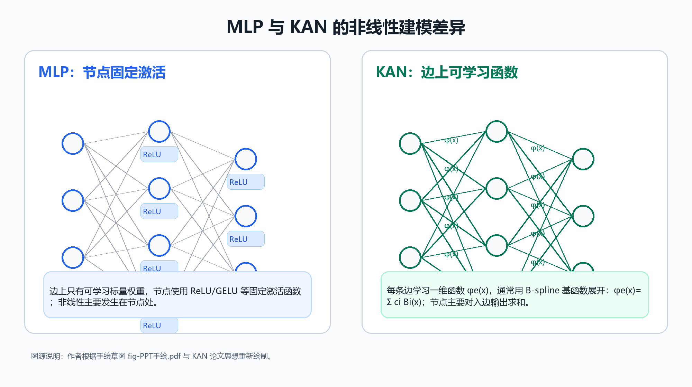

图 1 来源说明：作者根据原始手绘草图 `fig-PPT手绘.pdf`、KAN 论文思想和本文复现代码重新绘制。

### 2.2 U-KAN 分割网络

本文复现的 U-KAN 使用三层卷积编码器提取局部纹理特征，然后将中高层特征通过 PatchEmbed 转换为 token 序列，并输入 KANBlock。KANBlock 内部包含 LayerNorm、KANLayer、深度可分离卷积、BatchNorm 与 ReLU，并通过残差连接保持训练稳定。解码器部分逐级上采样，并将对应尺度的编码器特征通过 skip connection 加回。

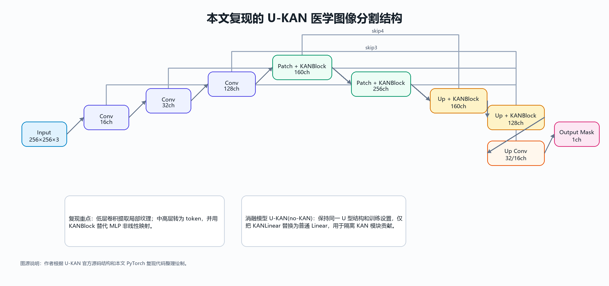

图 2 来源说明：作者根据 U-KAN 官方源码结构与本文 `src/ukan_course/models/ukan.py` 复现代码整理绘制。

在消融模型 U-KAN(no-KAN) 中，本文保持 U-KAN 的整体结构、输入尺度、训练参数和解码器完全一致，仅将 KANLinear 替换为普通 `nn.Linear`。因此，U-KAN 与 no-KAN 的性能差异可以更直接地反映 KAN 模块本身的贡献，而不是网络深度、跳跃连接或数据处理差异。

### 2.3 Attention-U-KAN 改进尝试

U-KAN 的 skip connection 直接将编码器细节与解码器语义特征相加。对于医学图像，低层特征中既包含边界纹理，也可能包含噪声和背景结构。因此本文尝试在 skip fusion 后加入轻量通道-空间注意力模块。该模块先通过全局平均池化和 1×1 卷积生成通道权重，再通过通道维平均图、最大图和 7×7 卷积生成空间权重，以此重标定融合特征。

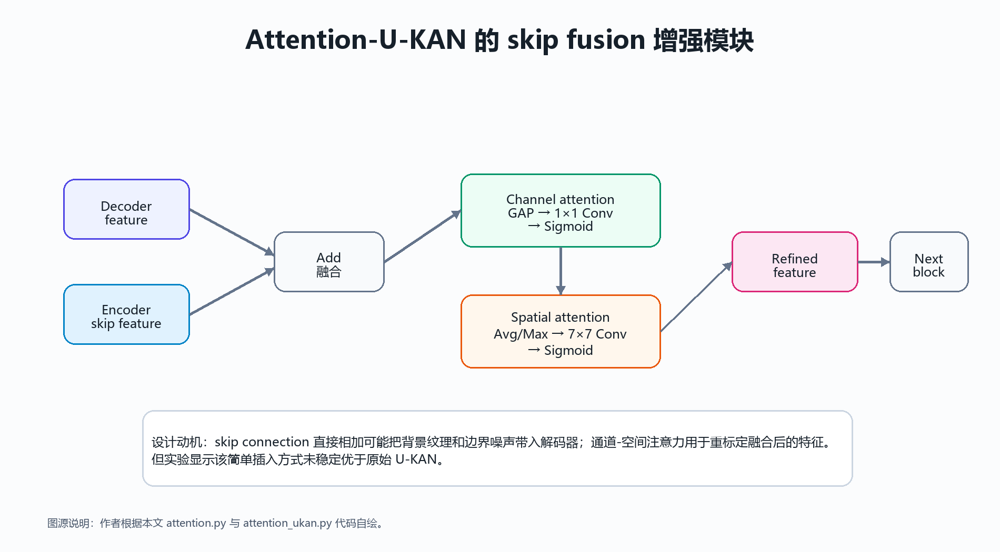

图 3 来源说明：作者根据本文 `attention.py` 与 `attention_ukan.py` 代码自绘。

需要说明的是，本文没有预设 Attention-U-KAN 一定优于 U-KAN，而是把它作为一个合理改进方向进行验证。如果实验结果不提升，仍然可以作为有效的消融结论：简单注意力模块是否适合 U-KAN，需要由数据和指标决定。

## 3 数据集、实验平台与实验设计

### 3.1 数据集与预处理

本文使用两个公开医学图像分割数据集。BUSI 数据集包含乳腺超声图像及病灶 mask，原始数据中部分病例存在多个 mask，本文在预处理阶段将同一图像对应的多个 mask 取并集合并，统一为单通道二值 mask。CVC-ClinicDB 数据集用于结肠镜息肉分割，图像和 mask 一一对应。两个数据集均被整理为 `data/processed/<dataset>/images` 与 `data/processed/<dataset>/masks` 格式，并通过固定 split 文件保存训练集和验证集划分。

| 数据集 | 图像数 | 宽度范围 | 高度范围 | 平均 mask 占比 | 处理说明 |
| --- | --- | --- | --- | --- | --- |
| BUSI | 780 | 190–1048 | 310–719 | 0.0783 | 乳腺超声病灶分割；多 mask 病例已合并 |
| CVC-ClinicDB | 612 | 384–384 | 288–288 | 0.0930 | 结肠镜息肉分割；图像与 mask 一一对应 |

表 1 来源说明：由本文 `dataset_report.py` 对整理后的本地数据统计生成。

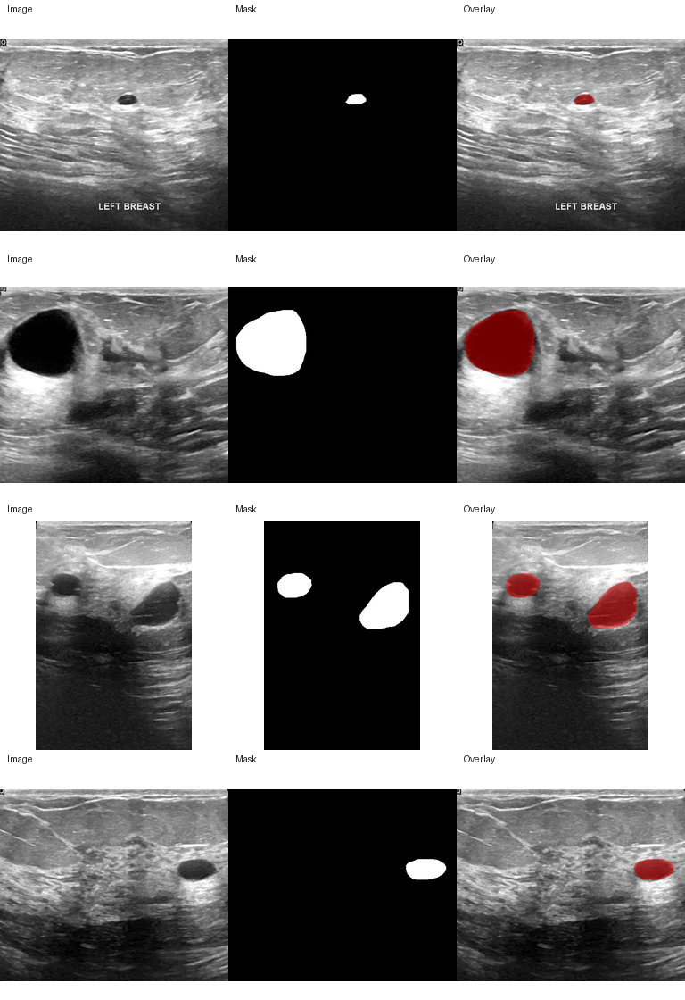

图 4 来源说明：由本文脚本从整理后的 BUSI 数据中抽样生成，原始数据来自公开 BUSI 数据集。

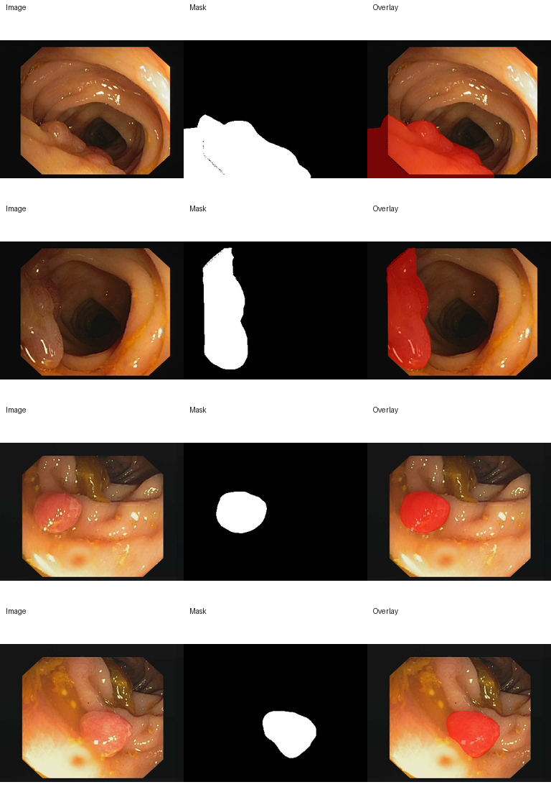

图 5 来源说明：由本文脚本从整理后的 CVC 数据中抽样生成，原始数据来自公开 CVC-ClinicDB 数据集。

### 3.2 实验平台与训练设置

本文实验在 Windows + Anaconda PyTorch 环境完成，训练和评估均使用同一块 NVIDIA RTX 4080 Laptop GPU。所有主实验使用 256×256 输入分辨率、batch size 8、100 epoch、Adam 优化器和 CosineAnnealingLR 调度器。损失函数为 BCEWithLogits 与 DiceLoss 的组合：

`Loss = 0.5 × BCEWithLogits(logits, mask) + (1 - Dice_soft)`

最终评估指标统一使用像素级混淆矩阵计算：

`IoU = TP / (TP + FP + FN)`  
`Dice = 2TP / (2TP + FP + FN)`  
`Precision = TP / (TP + FP)`  
`Recall = TP / (TP + FN)`  
`Specificity = TN / (TN + FP)`

| 项目 | 设置 | 说明 |
| --- | --- | --- |
| Python | 3.10.18 | Anaconda torch 环境 |
| PyTorch | 2.9.1+cu126 | CUDA 12.6 |
| GPU | NVIDIA GeForce RTX 4080 Laptop GPU | 单卡训练与评估 |
| 输入分辨率 | 256×256 | 所有模型统一 |
| Batch size / epoch | 8 / 100 | 主实验统一设置 |
| 优化器 / 学习率 | Adam；lr=1e-4，kan_lr=1e-2 | CosineAnnealingLR，min_lr=1e-5 |
| 损失函数 | 0.5×BCEWithLogits + DiceLoss | 二分类 mask 分割 |
| 随机种子 | 2981；补充 6142 | 固定划分并记录 split 文件 |

表 2 来源说明：由 `doctor_env.py`、YAML 配置文件和训练脚本记录整理。

### 3.3 对比实验设计

本文主实验包含 BUSI 与 CVC 两个数据集，每个数据集运行四组模型：U-Net、U-KAN(no-KAN)、U-KAN 和 Attention-U-KAN。U-Net 是经典 CNN 分割基线；no-KAN 是与 U-KAN 结构最接近的消融模型；U-KAN 是本文主复现模型；Attention-U-KAN 是本文改进尝试。实验流程如图 6 所示。

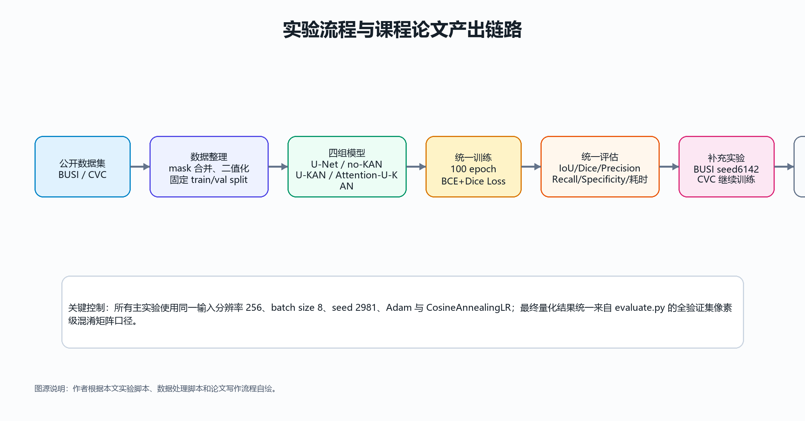

图 6 来源说明：作者根据本文数据处理、训练、评估和论文产出流程自绘。

为了回应训练过程中发现的问题，本文还设计了两个补充实验。其一，针对 BUSI no-KAN 曲线中局部跳升现象，补充 seed 6142 下的 U-KAN 与 no-KAN 对照，以判断 KAN 收益是否只是单一划分偶然结果。其二，针对 CVC 若干模型 best epoch 靠后的现象，从 CVC U-KAN 的 best checkpoint 出发继续训练 50 epoch，判断主复现模型是否仍未收敛。

## 4 实验结果与分析

### 4.1 BUSI 主实验结果

| 模型 | IoU | Dice | Precision | Recall | Specificity | 参数量 | 推理 ms/图 |
| --- | --- | --- | --- | --- | --- | --- | --- |
| U-Net | 0.6369 | 0.7782 | 0.8308 | 0.7319 | 0.9867 | 7.76M | 3.60 |
| U-KAN(no-KAN) | 0.6486 | 0.7869 | 0.8459 | 0.7356 | 0.9880 | 2.76M | 35.22 |
| U-KAN | 0.6874 | 0.8147 | 0.8177 | 0.8118 | 0.9838 | 6.36M | 37.15 |
| Attention-U-KAN | 0.6769 | 0.8074 | 0.8075 | 0.8072 | 0.9828 | 6.36M | 40.69 |

表 3 来源说明：由 `evaluate.py` 在 BUSI 验证集上统一评估生成；推理时间为单图平均耗时。

BUSI 结果显示，U-KAN 取得最佳 IoU 与 Dice，分别为 0.6874 和 0.8147。与 U-KAN(no-KAN) 相比，U-KAN 的 IoU 提升 0.0388，说明在相同 U 型框架中引入 KANLinear 能够提升病灶区域重叠质量。与 U-Net 相比，U-KAN 的 IoU 提升 0.0504，尤其 Recall 从 U-Net 的较低水平提升到 U-KAN 的 0.8118，说明 U-KAN 对病灶区域的召回能力更强。

Attention-U-KAN 在 BUSI 上低于原始 U-KAN，IoU 差距为 0.0104。这说明简单地在 skip fusion 后加入通道-空间注意力并不必然有效。BUSI 图像具有明显噪声和弱边界，注意力模块可能在突出高响应区域的同时抑制了部分模糊病灶边缘。

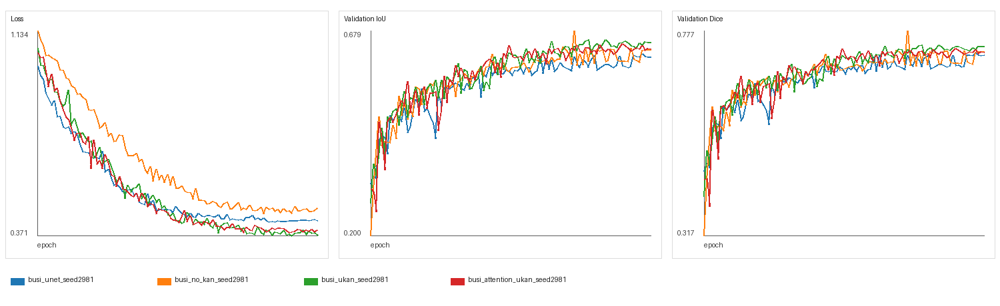

图 7 来源说明：由 `plot_training_curves.py` 根据训练日志生成。

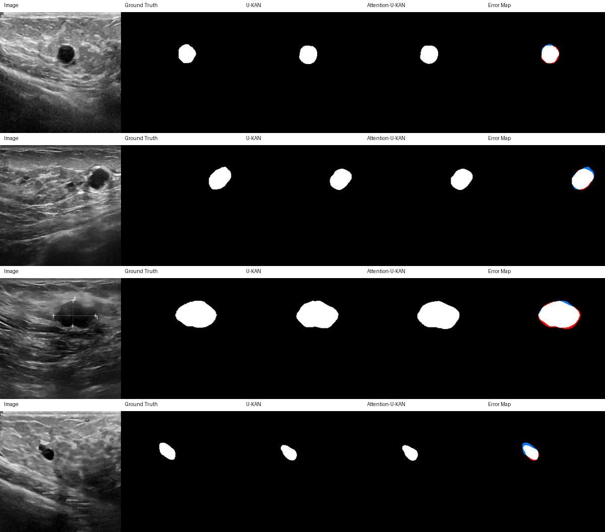

图 8 来源说明：由 `visualize_predictions.py` 根据验证集预测结果生成，包含原图、真值、预测和误差图。

### 4.2 CVC 主实验结果

| 模型 | IoU | Dice | Precision | Recall | Specificity | 参数量 | 推理 ms/图 |
| --- | --- | --- | --- | --- | --- | --- | --- |
| U-Net | 0.7803 | 0.8766 | 0.9248 | 0.8332 | 0.9929 | 7.76M | 3.72 |
| U-KAN(no-KAN) | 0.7699 | 0.8700 | 0.9048 | 0.8378 | 0.9907 | 2.76M | 43.46 |
| U-KAN | 0.7874 | 0.8810 | 0.9140 | 0.8503 | 0.9916 | 6.36M | 45.90 |
| Attention-U-KAN | 0.7631 | 0.8656 | 0.9207 | 0.8168 | 0.9926 | 6.36M | 44.02 |

表 4 来源说明：由 `evaluate.py` 在 CVC 验证集上统一评估生成；推理时间为单图平均耗时。

CVC 结果中，U-KAN 同样取得主实验最高 IoU 和 Dice，分别为 0.7874 和 0.8810。相对 no-KAN，U-KAN 的 IoU 提升 0.0175；相对 U-Net，IoU 提升 0.0070。相比 BUSI，CVC 中 U-KAN 对 U-Net 的提升幅度较小，可能是因为 CVC 图像分辨率固定、目标结构更规则，传统 U-Net 已经可以获得较强基线。

Attention-U-KAN 在 CVC 上低于 U-KAN，IoU 差距为 0.0243。这一结果与 BUSI 一致，说明本文采用的轻量注意力插入方式没有形成稳定收益。值得注意的是，Attention-U-KAN 的 Precision 较高，但 Recall 偏低，说明它更倾向于保守预测，减少误分背景的同时可能漏掉部分真实息肉区域。

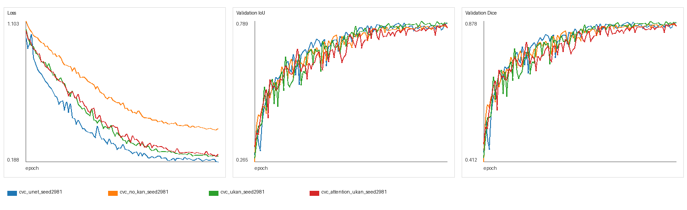

图 9 来源说明：由 `plot_training_curves.py` 根据训练日志生成。

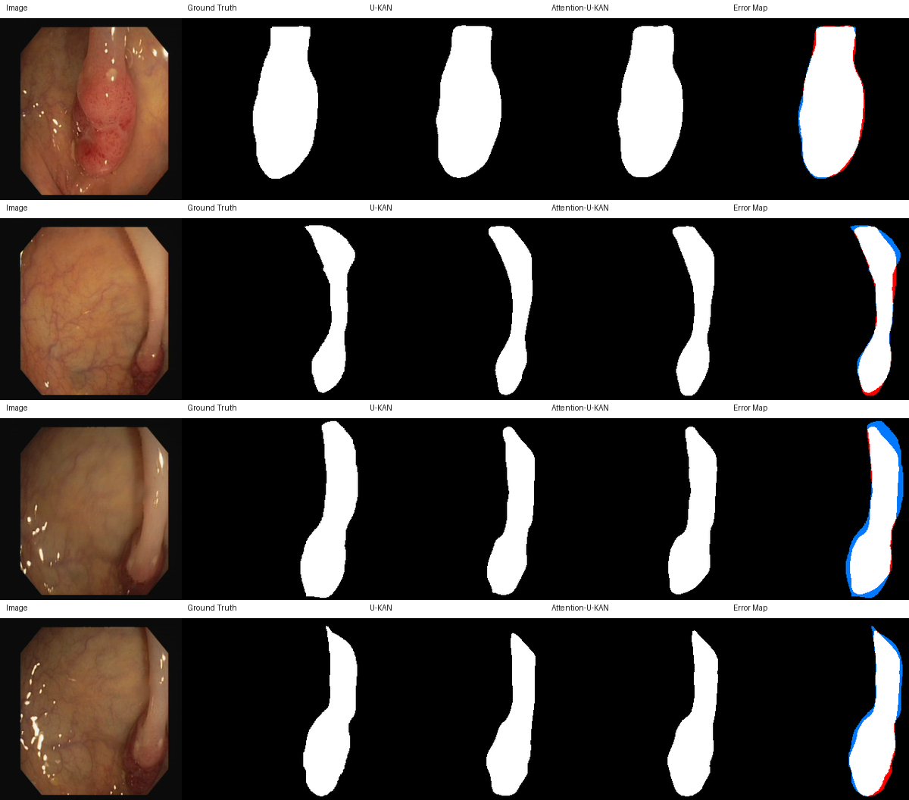

图 10 来源说明：由 `visualize_predictions.py` 根据验证集预测结果生成，包含原图、真值、预测和误差图。

### 4.3 训练诊断与补充实验

训练曲线显示，BUSI 的 no-KAN 在部分 epoch 出现验证 IoU 局部跳升，而 CVC 中部分模型的 best epoch 靠近训练末端。为避免只凭单次曲线下结论，本文使用训练诊断表和补充实验进行复核。

| 实验 | best epoch | 日志 best IoU | 最终 epoch IoU | 后 10 epoch 变化 | evaluate IoU |
| --- | --- | --- | --- | --- | --- |
| busi_unet | 96 | 0.6264 | 0.6185 | 0.0223 | 0.6369 |
| busi_no_kan | 72 | 0.6793 | 0.6353 | 0.0265 | 0.6486 |
| busi_ukan | 77 | 0.6581 | 0.6519 | -0.0029 | 0.6874 |
| busi_attention_ukan | 89 | 0.6486 | 0.6367 | -0.0073 | 0.6769 |
| cvc_unet | 99 | 0.7832 | 0.7832 | 0.0150 | 0.7803 |
| cvc_no_kan | 85 | 0.7746 | 0.7648 | 0.0027 | 0.7699 |
| cvc_ukan | 86 | 0.7893 | 0.7816 | 0.0006 | 0.7874 |
| cvc_attention_ukan | 98 | 0.7784 | 0.7648 | 0.0024 | 0.7631 |

表 5 来源说明：由 `analyze_training_logs.py` 汇总训练日志和最终评估结果生成。前 8 个主实验的旧训练日志曾使用 batch 平均指标，最终比较以 `evaluate.py` 全验证集混淆矩阵结果为准。

BUSI seed 6142 补充实验如下：

| 模型 | seed2981 IoU | seed2981 Dice | seed6142 IoU | seed6142 Dice | 两 seed 平均 IoU | 两 seed 平均 Dice |
| --- | --- | --- | --- | --- | --- | --- |
| U-KAN(no-KAN) | 0.6486 | 0.7869 | 0.5942 | 0.7454 | 0.6214 | 0.7661 |
| U-KAN | 0.6874 | 0.8147 | 0.6157 | 0.7621 | 0.6515 | 0.7884 |

表 6 来源说明：由 BUSI seed2981 与 seed6142 的 `evaluate.py` 结果整理生成。

seed 6142 中，U-KAN 仍高于 no-KAN；两 seed 平均后，U-KAN 的 IoU 为 0.6515，高于 no-KAN 的 0.6214。这说明 KAN 模块收益不是 seed 2981 的单次偶然现象。同时，seed 6142 的绝对指标整体低于 seed 2981，表明 BUSI 对随机划分和初始化较敏感，论文结论应强调“复现与课程资源条件下的验证”，而不是宣称完全复刻官方多 seed 最优结果。

CVC 继续训练补充实验如下：

| 实验 | 设置 | epoch | best epoch | IoU | Dice | 后 10 epoch IoU 变化 |
| --- | --- | --- | --- | --- | --- | --- |
| cvc_ukan_seed2981 | from_scratch | 100 | 86 | 0.7874 | 0.8810 | 0.0006 |
| cvc_ukan_seed2981_ft50 | resume_best_ft50 | 50 | 48 | 0.7847 | 0.8794 | 0.0063 |

表 7 来源说明：由 CVC U-KAN 原始训练与继续训练的日志、评估结果整理生成。

从原始 U-KAN best checkpoint 继续训练 50 epoch 后，IoU 为 0.7847，低于主实验的 0.7874，差距为 0.0027。因此，当前证据不支持“CVC 结果偏低只是因为没有继续训练”的解释。更合理的原因包括：本文主实验为 100 epoch 课程复现实验，官方通常使用更长训练轮数、多 seed 平均、不同 checkpoint 或不同数据处理细节。

### 4.4 过程记录与工程复现

为满足课程对过程记录和源码提交的要求，本文保留了训练、评估、预测 mask 生成和结果汇总截图，并在 GitHub 仓库中提供可复现的脚本、配置文件和 README。

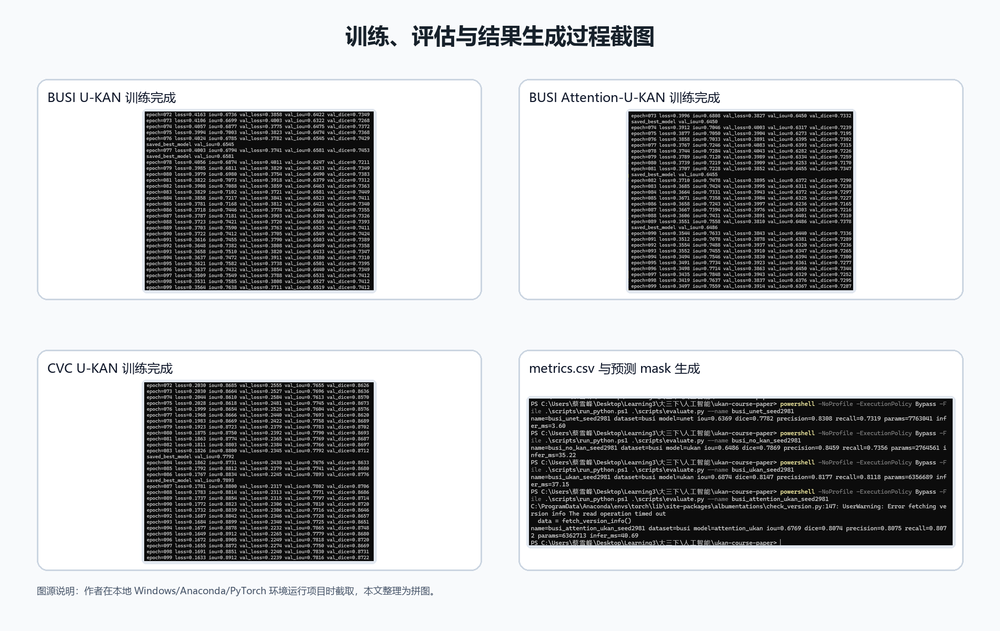

图 11 来源说明：作者本地运行训练、评估和可视化脚本时截取，本文整理为拼图。

## 5 讨论

第一，U-KAN 的优势主要体现在 KAN 模块本身，而不是简单的参数量堆叠。BUSI 中 no-KAN 的参数量约 2.76M，U-KAN 约 6.36M，U-Net 约 7.76M。虽然 U-KAN 参数量低于 U-Net，但仍取得更高 IoU 和 Dice，说明其 tokenized KANBlock 对医学图像分割具有有效表达能力。CVC 中 U-KAN 对 U-Net 的提升较小，但仍保持最高主指标，说明其收益与数据集难度和目标形态有关。

第二，KAN 带来了明显推理代价。U-Net 单图推理时间约 3.6–3.7 ms，而 U-KAN 系列约 37–46 ms。这与 KANLinear 的 B-spline 基函数计算、token 展平和高维线性变换有关。因此在实际医学部署中，需要在分割精度和推理效率之间权衡。对于实时内镜场景，U-KAN 可能需要剪枝、蒸馏或轻量化；对于离线超声辅助分析，较高推理时间更容易接受。

第三，Attention-U-KAN 的负结果是有价值的。很多课程论文容易把“加入注意力机制”直接写成提升点，但本文实验显示简单插入注意力并不稳定。可能原因包括：数据规模有限导致注意力模块过拟合；通道-空间注意力过度抑制模糊边界；插入位置不够精细；U-KAN 本身已经在中高层通过 KANBlock 提升了非线性表达，简单注意力的边际收益有限。后续若继续改进，可以尝试只在高层语义 skip 上加入注意力，或结合边界损失、多尺度监督和不确定性建模。

第四，本文对训练日志口径进行了修正。早期主实验的训练曲线用于观察收敛趋势，但旧日志中的验证 IoU/Dice 采用 batch 平均；最终论文表格全部采用 `evaluate.py` 的全验证集像素级混淆矩阵口径。补充实验之后，`train.py` 已调整为与 `evaluate.py` 一致的全局统计方式。因此，新旧训练曲线不应直接比较绝对值，最终模型比较应以统一评估表为准。

第五，本文仍存在局限。受课程时间和算力约束，CVC 没有完成官方推荐的 400 epoch 和三 seed 完整平均；BUSI 只补充了一个额外 seed；当前评估集来自固定验证划分，不是完全独立外部测试集。尽管如此，本文完成了从数据整理、模型复现、消融对比、补充实验、可视化到工程文档的完整流程，足以支撑课程论文中的算法复现和独立分析。

## 6 课程要求与加分项完成情况

| 加分/要求项 | 完成方式 | 论文或项目位置 |
| --- | --- | --- |
| GitHub 源码链接 | 完整工程已配置远程仓库 https://github.com/Simon-Tisa/AI_CourseWork.git | README 与本文来源说明 |
| 详细 README | 包含环境、数据准备、训练、评估、绘图和结果汇总命令 | README.md |
| 项目结构 | configs/scripts/src/tests/experiments/paper 分层组织 | GitHub 仓库 |
| 数据整理 | BUSI/CVC 公开数据统一清洗、mask 合并、固定 split | scripts/prepare_*.py 与 data/splits |
| 自绘图 | KAN 原理图、U-KAN 结构图、Attention 模块图、实验流程图 | paper/figures |
| 图表编号与来源 | 所有图表均编号并标注生成脚本或数据来源 | 论文正文 |
| 过程记录 | 训练与评估截图、训练日志、metrics.csv、预测 mask | 课程论文要求/图片 与 experiments/results |
| 独立思考 | 针对曲线异常和 CVC 收敛性追加 seed 与继续训练实验 | 表 5–7 与讨论章节 |

## 7 结论

本文完成了 U-KAN 医学图像分割算法的课程复现与扩展实验。通过 BUSI 和 CVC 两个数据集的主实验，U-KAN 均取得当前实验矩阵中的最佳 IoU 和 Dice；与 no-KAN 的对比说明 KANLinear 对分割性能具有实际贡献；与 U-Net 的对比说明 U-KAN 在精度上具有优势，但推理速度明显较慢。Attention-U-KAN 的实验结果未超过原始 U-KAN，提示简单注意力机制并非稳定改进方向。

补充实验进一步增强了结论可信度。BUSI seed 6142 显示 U-KAN 相对 no-KAN 的优势仍然存在，但绝对指标受随机划分影响较大；CVC 继续训练实验没有超过原始 100 epoch best checkpoint，说明当前 U-KAN 结果与官方参考差距不能简单归因于训练不够。总体而言，本文不仅完成了算法复现，还通过消融实验、补充实验和负结果讨论体现了独立分析能力。最终项目形成了可运行代码、清晰 README、数据处理脚本、实验日志、图表资产和规范课程论文，满足课程方向（一）及多个加分项要求。

## 参考文献

[1] Li C., Liu X., Li W., et al. U-KAN Makes Strong Backbone for Medical Image Segmentation and Generation. arXiv preprint, 2024.  
[2] Liu Z., Wang Y., Vaidya S., et al. KAN: Kolmogorov-Arnold Networks. arXiv:2404.19756, 2024.  
[3] Ronneberger O., Fischer P., Brox T. U-Net: Convolutional Networks for Biomedical Image Segmentation. MICCAI, 2015.  
[4] Woo S., Park J., Lee J.-Y., Kweon I. S. CBAM: Convolutional Block Attention Module. ECCV, 2018.  
[5] Al-Dhabyani W., Gomaa M., Khaled H., Fahmy A. Dataset of Breast Ultrasound Images. Data in Brief, 2020.  
[6] Bernal J., Sánchez F. J., Fernández-Esparrach G., et al. WM-DOVA maps for accurate polyp highlighting in colonoscopy. Computerized Medical Imaging and Graphics, 2015.  
[7] CUHK-AIM-Group. U-KAN official GitHub repository. https://github.com/CUHK-AIM-Group/U-KAN  
[8] Liu Z. pykan official GitHub repository. https://github.com/KindXiaoming/pykan  
[9] A Review of KANs for Medical Image Analysis. 本地课程材料中的 KAN 医学图像分析综述资料。
