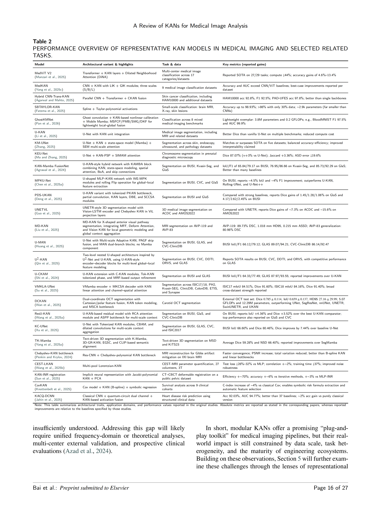
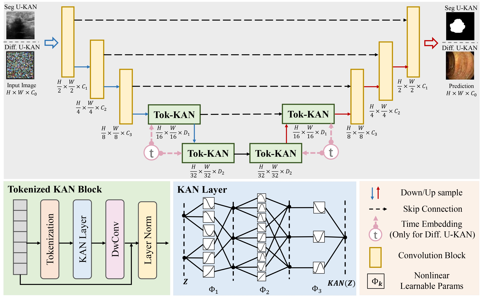
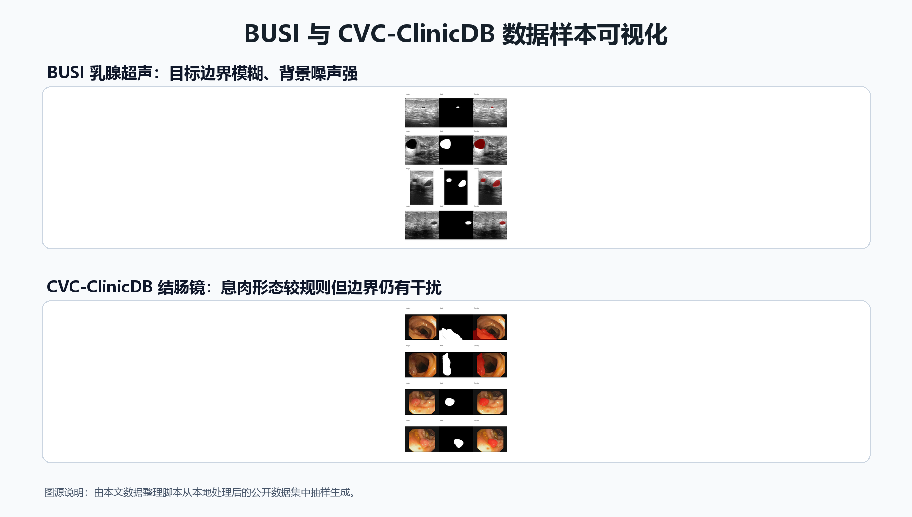
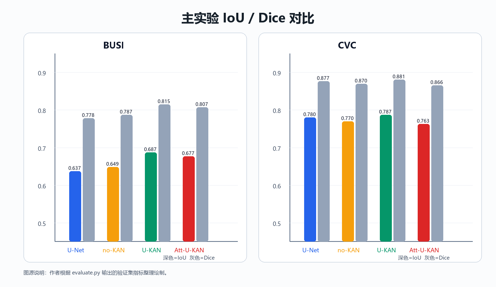
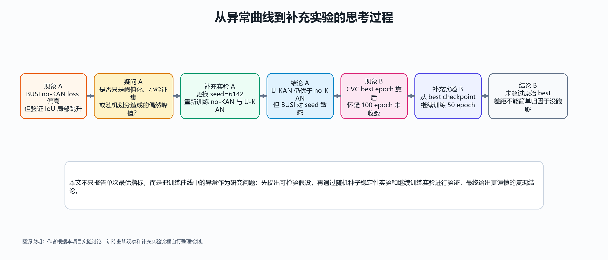
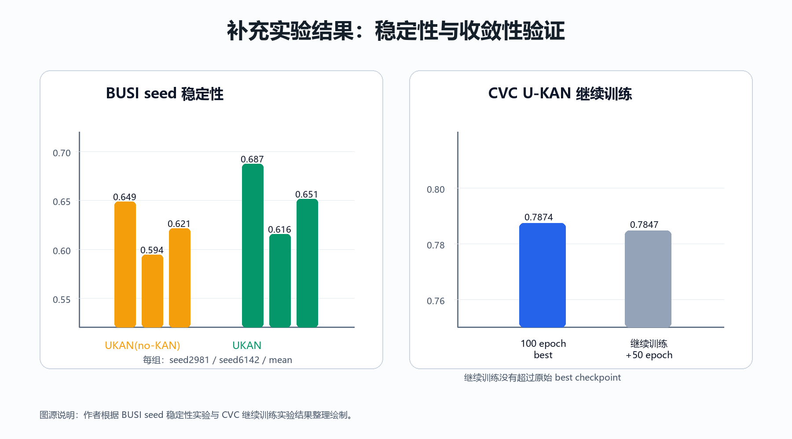
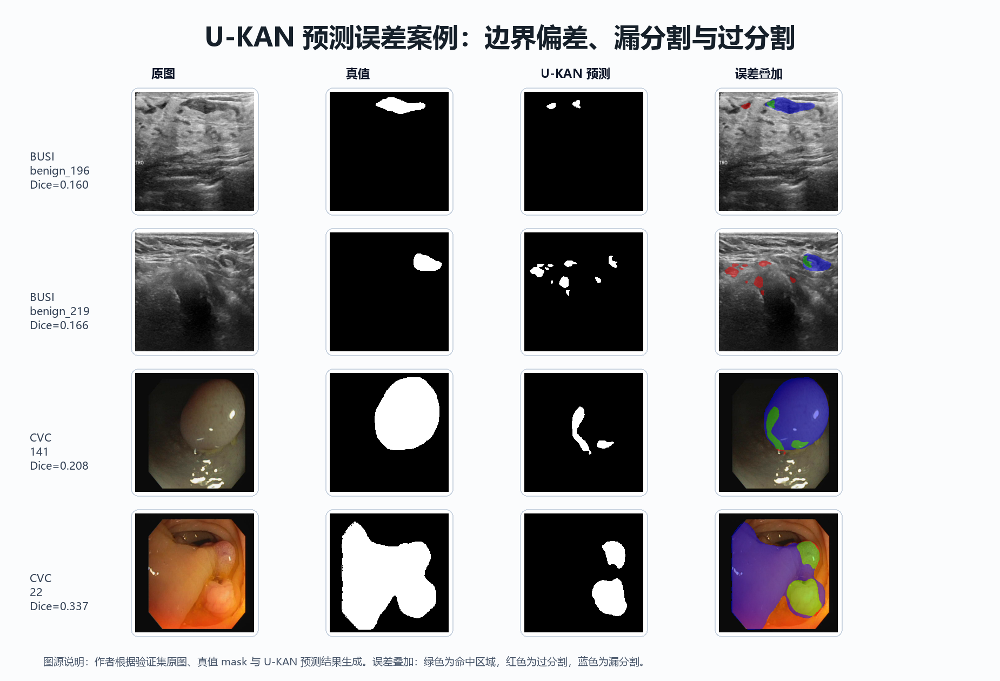

# 基于 U-KAN 的医学图像分割算法复现、实验诊断与注意力增强研究

**课程方向**：方向（一）复现任意人工智能算法  
**项目 GitHub**：[https://github.com/Simon-Tisa/AI_CourseWork.git](https://github.com/Simon-Tisa/AI_CourseWork.git)  
**作者**：蔡雪峰  
**日期**：2026 年 6 月

## 来源说明与过程声明

本文在课程材料、U-KAN 官方论文与源码、KAN 医学图像分析综述、ResU-KAN、KC-UNet、TransUKAN、VMKLA-UNet、LightM-UNet 等论文基础上确定写作结构和实验组织方式。论文并非简单复述 U-KAN，而是在本地 PyTorch 工程中完成数据整理、模型复现、对比实验、异常曲线诊断和补充验证。所有实验表格均来自本项目 `evaluate.py` 和训练日志；所有训练曲线、预测对比、误差案例和截图均来自本地运行结果。

图源分为四类：第一，作者原始 PPT 手绘图，文件为 `fig-PPT手绘.pdf`，本文将其作为 KAN 与 MLP 对比思路来源；第二，U-KAN 官方框架图和 KAN 医学综述表格，用于说明算法来源和选题背景，并在图注中标明出处；第三，本项目实验脚本生成的数据样本、训练曲线、预测结果和误差分析；第四，作者根据工程流程和实验思考过程整理绘制的实验流程图、诊断流程图和补充实验概览图。本文写作和排版使用 OpenAI Codex 辅助，但实验设计、运行过程、指标和结论均基于本地项目记录。

## 摘要

医学图像分割是计算机辅助诊断中的关键任务。U-Net 系列模型通过编码器、解码器和跳跃连接获得了稳定的分割性能，但普通卷积和 MLP 对复杂非线性边界的表达仍存在限制。U-KAN 将 Kolmogorov-Arnold Network 的可学习边函数引入 U 型结构，在 tokenized KAN block 中用样条函数增强非线性建模能力。本文选择 U-KAN 作为人工智能课程论文的复现对象，在 BUSI 乳腺超声和 CVC-ClinicDB 结肠镜息肉数据集上复现 U-KAN，并构建 U-Net、U-KAN(no-KAN)、U-KAN 和 Attention-U-KAN 四组对照。

与早期草稿不同，本文重点体现实验思考过程：在 BUSI 训练曲线中，no-KAN 的 loss 曲线较高但验证 IoU 局部跳升，引发“该结果是否偶然”的疑问，因此补充 seed 6142 稳定性实验；在 CVC 训练中，多个模型 best epoch 靠近训练末端，引发“是否未收敛”的疑问，因此从 U-KAN best checkpoint 继续训练 50 epoch。结果显示，U-KAN 在 BUSI 上取得 IoU=0.6874、Dice=0.8147，在 CVC 上取得 IoU=0.7874、Dice=0.8810，均为主实验最优；seed 6142 中 U-KAN 仍高于 no-KAN，但 BUSI 绝对指标对 seed 敏感；CVC 继续训练未超过原始 best checkpoint。实验说明 KAN 模块对医学图像分割有实际贡献，但简单注意力插入并未稳定提升，且 U-KAN 存在推理速度代价。

**关键词**：U-KAN；Kolmogorov-Arnold Network；医学图像分割；算法复现；消融实验；实验诊断

## 1 引言

医学图像分割要求模型在噪声强、目标边界模糊、标注数据有限的条件下定位病灶区域。BUSI 乳腺超声图像中的病灶边界常受声影、组织纹理和弱对比影响；CVC-ClinicDB 中息肉形态相对规则，但内镜反光、褶皱和边缘模糊仍会造成误分割。U-Net 是医学图像分割的经典框架，其编码器-解码器结构和跳跃连接适合恢复空间细节，但模型的中高层非线性表达通常依赖卷积或普通 MLP。

KAN 的核心思想是把可学习的一维函数放在网络边上，而不是只在节点使用固定激活函数。U-KAN 将这一思想嵌入 U 型医学图像分割网络，在高层 token 特征上使用 KAN layer 和 depthwise convolution 构成 tokenized KAN block。与直接引入 Transformer 相比，U-KAN 的动机更强调非线性函数表达和一定可解释性。课程论文选择 U-KAN 的原因有三点：其一，它是明确的人工智能算法复现对象；其二，它天然适合医学图像分割实验，包括数据整理、对比实验和可视化；其三，KAN vs MLP、U-KAN vs U-Net、attention 改进是否有效等问题可以形成完整的消融分析。

本文贡献如下。第一，参考 U-KAN 官方代码重写并组织课程工程，完成 BUSI/CVC 数据处理、训练、评估和结果汇总。第二，构建 U-Net、no-KAN、U-KAN 和 Attention-U-KAN 四组模型，对 KAN 模块和注意力模块进行可解释消融。第三，针对训练曲线中出现的异常现象提出假设并补做实验，体现从结果观察到实验验证的研究过程。第四，整理 GitHub、README、运行截图、自绘图、论文图源和完整 Word 成稿，覆盖课程论文要求和加分项。

## 2 相关工作与论文实验组织参考

为了避免论文只停留在“跑代码和贴结果”，本文先阅读并整理了 U-KAN 及多篇 KAN 医学图像分割论文的实验组织方式。U-KAN 原论文包含 SOTA 对比、效率对比、定性分割图、可解释性图、KAN 层数消融、KAN vs MLP 消融和模型规模消融。ResU-KAN 的实验章节更细，包括数据集、损失函数、评价指标、参数设置、SOTA 对比、可视化分析、边界误差分析和消融实验。KC-UNet 则专门比较 KAN 层数、MLP 替代、不同 attention 机制和模型效率。这些论文共同说明，医学图像分割论文不能只报告一个主表，而应同时给出结构图、数据图、训练与预测可视化、消融、效率和局限讨论。

| 参考论文 | 文章组织 | 实验/图表特点 | 对本文的借鉴 |
| --- | --- | --- | --- |
| U-KAN | Related Work、Method、Experiments、Ablation Studies | SOTA 对比、效率表、定性分割图、KAN 层数消融、KAN vs MLP 消融 | 本文采用 U-KAN/no-KAN/效率/可视化的基本实验骨架 |
| ResU-KAN | Related work、Method、Experimental results and analysis | Dataset、Loss、Metrics、Parameter、SOTA、Visualization、Boundary/error analysis、Ablation | 本文新增训练异常诊断、误差案例和补充实验讨论 |
| KC-UNet | 架构说明、预处理图、消融与多数据集对比 | KAN 层数、MLP 替代、attention 机制、四数据集结果、效率表、Dice 对比图 | 本文把 no-KAN 和 Attention-U-KAN 写成明确消融，而非简单改进 |
| TransUKAN / VMKLA-UNet | Related Work、Methodology、Implementation Details、SOTA、Ablation | 结构图、模块图、复杂度/推理时间、跨数据集可视化 | 本文保留参数量与推理时间，讨论精度和效率权衡 |
| KAN 医学综述 | 按任务和模型类型归纳 KAN 医学应用 | 模型、任务、指标和代表性收益汇总表 | 本文用它说明医学分割方向和 U-KAN 选题来源 |

表 1 来源说明：作者根据本地课程材料中的 U-KAN、ResU-KAN、KC-UNet、TransUKAN、VMKLA-UNet 与 KAN 医学综述论文整理。

图 1 KAN 医学图像分析综述中的代表模型与任务汇总。来源：A Review of KANs for Medical Image Analysis，本地课程材料。本文用于说明 KAN 医学应用背景。

## 3 方法

### 3.1 KAN 与 MLP 的区别

传统 MLP 通常学习线性权重，并在节点使用固定激活函数，如 ReLU、GELU 或 SiLU。KAN 则将每条边的映射定义为可学习的一维函数，可用 B-spline 基函数展开：φ(x)=ΣciBi(x)。这种形式使网络不只依赖固定节点激活，而是在边上学习更灵活的非线性映射。作者的 PPT 手绘图最初正是围绕这一差异展开：MLP 是 fixed node activations + scalar edge weights，而 KAN 是 learnable 1D edge functions。

图 2 MLP 与 KAN 的建模差异。来源：作者根据 PPT 自绘图 fig-PPT手绘.pdf 重新整理为论文位图；原始 PDF 已保存在 paper 目录。

### 3.2 U-KAN 复现模型

U-KAN 保留 U-Net 的编码器-解码器和 skip connection，但在中高层特征处引入 tokenized KAN block。低层卷积负责提取局部纹理，高层 PatchEmbed 将特征转为 token，KAN layer 对 token 进行非线性映射，再通过 depthwise convolution 加入局部空间归纳偏置。本文复现代码中，`U-KAN(no-KAN)` 保持同一 U 型结构，仅将 KANLinear 替换为普通 Linear，因此它不是 U-Net，而是用于隔离 KAN 模块贡献的消融模型。

图 3 U-KAN 原论文/官方项目中的总体结构图。来源：U-KAN 官方开源项目 assets/framework-1.jpg，本文用于说明复现对象的原始结构。

### 3.3 Attention-U-KAN 改进尝试

本文尝试在 skip fusion 后加入轻量通道-空间注意力模块。其动机是：skip connection 会把低层纹理和边界细节传给解码器，但也可能带入背景噪声；通道注意力可以重标定语义通道，空间注意力可以突出疑似病灶区域。然而，这只是一个可检验假设，不能预设一定提升。实验结果最终显示 Attention-U-KAN 没有超过原始 U-KAN，这一负结果本身也是本文消融分析的重要部分。

图 4 Attention-U-KAN 的 skip fusion 增强模块。来源：作者根据本文 attention.py 与 attention_ukan.py 代码自行绘制。

## 4 实验设计

### 4.1 数据集与预处理

本文使用 BUSI 和 CVC-ClinicDB 两个公开数据集。BUSI 原始数据中部分图像有多个 mask，本文将同一图像的多个 mask 取并集合并，得到单通道二值病灶标注；CVC-ClinicDB 图像与 mask 一一对应。所有图像统一整理到 `data/processed`，并通过固定 split 文件保存训练/验证划分，避免不同模型使用不同样本划分。

| 数据集 | 图像数 | 宽度范围 | 高度范围 | 平均 mask 占比 | 处理说明 |
| --- | --- | --- | --- | --- | --- |
| BUSI | 780 | 190–1048 | 310–719 | 0.0783 | 乳腺超声病灶分割；多 mask 病例已合并 |
| CVC-ClinicDB | 612 | 384–384 | 288–288 | 0.0930 | 结肠镜息肉分割；图像与 mask 一一对应 |

表 2 来源说明：由本文 `dataset_report.py` 对整理后的本地数据统计生成。

图 5 BUSI 与 CVC-ClinicDB 数据样本可视化。来源：作者根据本文数据处理脚本生成。

### 4.2 实验设置与评价指标

所有主实验使用 256×256 输入分辨率、batch size 8、100 epoch、Adam 优化器和 CosineAnnealingLR。损失函数为 `0.5×BCEWithLogits + DiceLoss`。最终结果不使用训练日志中的 batch 平均指标，而统一使用 `evaluate.py` 在全验证集像素级混淆矩阵上计算 IoU、Dice、Precision、Recall 和 Specificity。这样可以避免训练曲线局部波动被误读为最终模型能力。

| 项目 | 设置 | 说明 |
| --- | --- | --- |
| Python | 3.10.18 | Anaconda torch 环境 |
| PyTorch | 2.9.1+cu126 | CUDA 12.6 |
| GPU | NVIDIA GeForce RTX 4080 Laptop GPU | 单卡训练与评估 |
| 输入分辨率 | 256×256 | 所有模型统一 |
| Batch size / epoch | 8 / 100 | 主实验统一设置 |
| 优化器 / 学习率 | Adam；lr=1e-4，kan_lr=1e-2 | CosineAnnealingLR，min_lr=1e-5 |
| 损失函数 | 0.5×BCEWithLogits + DiceLoss | 二分类 mask 分割 |
| 随机种子 | 2981；补充 6142 | 固定划分并记录 split 文件 |

表 3 来源说明：由 `doctor_env.py`、YAML 配置与训练脚本记录整理。

为了让复现过程可检查，本文将数据处理、训练、评估、绘图、补充实验和论文生成都落到脚本层面，形成从原始数据到课程论文材料的闭环。

图 6 项目实验流程与代码组织。来源：作者根据本文工程目录、训练脚本和论文生成流程自行绘制。

## 5 主实验结果

### 5.1 BUSI 结果

| 模型 | IoU | Dice | Precision | Recall | Specificity | 参数量 | 推理 ms/图 |
| --- | --- | --- | --- | --- | --- | --- | --- |
| U-Net | 0.6369 | 0.7782 | 0.8308 | 0.7319 | 0.9867 | 7.76M | 3.60 |
| U-KAN(no-KAN) | 0.6486 | 0.7869 | 0.8459 | 0.7356 | 0.9880 | 2.76M | 35.22 |
| U-KAN | 0.6874 | 0.8147 | 0.8177 | 0.8118 | 0.9838 | 6.36M | 37.15 |
| Attention-U-KAN | 0.6769 | 0.8074 | 0.8075 | 0.8072 | 0.9828 | 6.36M | 40.69 |

表 4 来源说明：由 `evaluate.py` 在 BUSI 验证集上统一评估生成。

BUSI 上，U-KAN 取得 IoU=0.6874、Dice=0.8147，优于 U-Net、no-KAN 和 Attention-U-KAN。与 no-KAN 相比，U-KAN 的 IoU 提升 0.0388，说明在同一 U 型结构中引入 KANLinear 对病灶重叠质量有实际贡献。no-KAN 的 Precision 较高但 Recall 较低，说明其预测更保守；U-KAN 的 Recall 明显提升，更有利于减少漏分割。

图 7 BUSI 训练曲线。来源：作者根据训练日志生成。

图 8 BUSI 预测结果对比。来源：作者根据验证集预测结果生成。

### 5.2 CVC 结果

| 模型 | IoU | Dice | Precision | Recall | Specificity | 参数量 | 推理 ms/图 |
| --- | --- | --- | --- | --- | --- | --- | --- |
| U-Net | 0.7803 | 0.8766 | 0.9248 | 0.8332 | 0.9929 | 7.76M | 3.72 |
| U-KAN(no-KAN) | 0.7699 | 0.8700 | 0.9048 | 0.8378 | 0.9907 | 2.76M | 43.46 |
| U-KAN | 0.7874 | 0.8810 | 0.9140 | 0.8503 | 0.9916 | 6.36M | 45.90 |
| Attention-U-KAN | 0.7631 | 0.8656 | 0.9207 | 0.8168 | 0.9926 | 6.36M | 44.02 |

表 5 来源说明：由 `evaluate.py` 在 CVC 验证集上统一评估生成。

CVC 上，U-KAN 同样取得主实验最优 IoU 和 Dice。相比 BUSI，U-KAN 对 U-Net 的提升幅度较小，说明 CVC 数据中传统 U-Net 已经是较强基线。Attention-U-KAN 的 Precision 较高但 Recall 下降，表明该模型更容易做保守预测，漏掉部分真实息肉区域。

图 9 CVC 训练曲线。来源：作者根据训练日志生成。

图 10 CVC 预测结果对比。来源：作者根据验证集预测结果生成。

图 11 主实验 IoU/Dice 可视化对比。来源：作者根据 evaluate.py 指标整理绘制。

## 6 消融实验、异常诊断与补充验证

### 6.1 KAN 与注意力模块消融

| 消融问题 | 数据集 | IoU 变化 | Dice 变化 | 结论 |
| --- | --- | --- | --- | --- |
| KAN vs MLP(no-KAN) | BUSI | +0.0388 | +0.0279 | KANLinear 相比普通 Linear 提升明显 |
| KAN vs MLP(no-KAN) | CVC | +0.0175 | +0.0111 | 提升较小但方向一致 |
| Attention 插入 | BUSI | -0.0104 | -0.0074 | 简单通道-空间注意力未超过 U-KAN |
| Attention 插入 | CVC | -0.0243 | -0.0154 | Precision 较高但 Recall 降低，预测更保守 |

表 6 来源说明：由 U-KAN、no-KAN 与 Attention-U-KAN 的主实验结果整理。

U-KAN 相对 no-KAN 在 BUSI 和 CVC 上均有提升，因此 KAN 模块的贡献比单纯网络结构更可信。Attention-U-KAN 没有超过原始 U-KAN，说明“加注意力”不是必然加分项；更合理的结论是，本文尝试的简单通道-空间注意力插入方式未与 U-KAN 形成稳定互补。

### 6.2 从异常曲线到补充实验

训练过程中，BUSI no-KAN 的橙色 loss 曲线明显高于其他模型，下降也更慢，但验证 IoU/Dice 在局部 epoch 出现跳升。这一现象不应被直接解释为 no-KAN 学得更好，因为 BCE+Dice loss 是连续概率空间中的训练目标，而 IoU/Dice 是阈值化后的离散分割指标；当目标区域较小、验证集规模有限时，少数样本的阈值变化可能造成指标跳变。因此本文提出第一个疑问：no-KAN 的局部高点是否可能是随机划分或阈值化造成的偶然结果？

CVC 训练曲线中，部分模型的 best epoch 靠近 100 epoch 末端，同时本地 CVC U-KAN 低于官方 README 参考值，这引出第二个疑问：模型是否只是训练不够？围绕这两个疑问，本文设计了两个补充实验，而不是直接接受单次曲线。

图 12 从异常曲线到补充实验的思考过程。来源：作者根据本项目实验讨论和补充实验流程整理绘制。

### 6.3 BUSI seed 稳定性实验

| 模型 | seed2981 IoU | seed2981 Dice | seed6142 IoU | seed6142 Dice | 两 seed 平均 IoU | 两 seed 平均 Dice |
| --- | --- | --- | --- | --- | --- | --- |
| U-KAN(no-KAN) | 0.6486 | 0.7869 | 0.5942 | 0.7454 | 0.6214 | 0.7661 |
| U-KAN | 0.6874 | 0.8147 | 0.6157 | 0.7621 | 0.6515 | 0.7884 |

表 7 来源说明：由 BUSI seed 2981 与 seed 6142 的 `evaluate.py` 结果整理。

seed 6142 下，U-KAN 仍高于 no-KAN；两 seed 平均后，U-KAN IoU 为 0.6515，高于 no-KAN 的 0.6214。这说明 KAN 的收益不是 seed 2981 的单次偶然峰值。但 seed 6142 的绝对指标整体下降，也说明 BUSI 对数据划分和初始化敏感。因此论文结论必须谨慎：本文证明了本地复现条件下 KAN 有稳定趋势，但不应夸大单次 seed 的数值。

### 6.4 CVC 继续训练实验

| 实验 | 设置 | epoch | best epoch | IoU | Dice | 后 10 epoch IoU 变化 |
| --- | --- | --- | --- | --- | --- | --- |
| cvc_ukan_seed2981 | from_scratch | 100 | 86 | 0.7874 | 0.8810 | 0.0006 |
| cvc_ukan_seed2981_ft50 | resume_best_ft50 | 50 | 48 | 0.7847 | 0.8794 | 0.0063 |

表 8 来源说明：由 CVC U-KAN 原始训练与继续训练结果整理。

从 CVC U-KAN best checkpoint 继续训练 50 epoch 后，IoU 为 0.7847，未超过原始 100 epoch 的 0.7874。因此，目前证据不支持“CVC 结果偏低只是因为没有继续训练”的解释。更可能的原因包括官方训练轮数更长、数据划分和预处理不同、官方 checkpoint 或多 seed 平均差异。

图 13 补充实验结果概览。来源：作者根据 BUSI seed 稳定性与 CVC 继续训练实验整理绘制。

### 6.5 误差案例分析

图 14 U-KAN 预测误差案例分析。来源：作者根据验证集原图、真值 mask 与 U-KAN 预测结果生成。

误差案例显示，U-KAN 的主要问题不是完全无法定位目标，而是在弱边界、小目标和边缘不规则区域容易出现漏分割或过分割。BUSI 中边界模糊和声影会让模型低估病灶范围；CVC 中反光和褶皱可能造成边界偏移。这也解释了为什么简单 attention 可能提高 Precision 却降低 Recall：注意力模块更保守地抑制不确定区域，反而漏掉部分真实目标。

## 7 与官方结果、效率和课程加分项的关系

| 项目 | 官方 IoU | 官方 F1/Dice | 本文 IoU | 本文 Dice | 说明 |
| --- | --- | --- | --- | --- | --- |
| BUSI U-KAN | 0.6526 | 0.7875 | 0.6874 | 0.8147 | 本地复现结果高于官方 README 单 run 参考值 |
| BUSI no-KAN | 0.6349 | 0.7707 | 0.6486 | 0.7869 | 趋势一致：U-KAN 高于 no-KAN |
| CVC U-KAN | 0.8561 | 0.9219 | 0.7874 | 0.8810 | 低于官方参考，需结合 epoch、split、checkpoint 与多 seed 差异解释 |

表 9 来源说明：官方参考值来自 U-KAN README；本文结果来自本地 `evaluate.py`。

| 数据集 | 模型 | 参数量 | 推理 ms/图 | IoU | Dice |
| --- | --- | --- | --- | --- | --- |
| BUSI | U-Net | 7.76M | 3.60 | 0.6369 | 0.7782 |
| BUSI | U-KAN(no-KAN) | 2.76M | 35.22 | 0.6486 | 0.7869 |
| BUSI | U-KAN | 6.36M | 37.15 | 0.6874 | 0.8147 |
| BUSI | Attention-U-KAN | 6.36M | 40.69 | 0.6769 | 0.8074 |
| CVC | U-Net | 7.76M | 3.72 | 0.7803 | 0.8766 |
| CVC | U-KAN(no-KAN) | 2.76M | 43.46 | 0.7699 | 0.8700 |
| CVC | U-KAN | 6.36M | 45.90 | 0.7874 | 0.8810 |
| CVC | Attention-U-KAN | 6.36M | 44.02 | 0.7631 | 0.8656 |

表 10 来源说明：参数量由模型统计脚本输出，推理时间由 `evaluate.py` 记录。

U-Net 的推理速度显著快于 U-KAN 系列，而 U-KAN 在 BUSI 和 CVC 上取得更好分割指标。这说明 KAN 带来的不是免费提升，而是精度和效率之间的权衡。课程论文中必须把这一点写清楚，否则会显得只选择性报告好结果。

| 要求/加分项 | 本文落实方式 | 位置 |
| --- | --- | --- |
| GitHub 源码链接 | 完整项目远程仓库 https://github.com/Simon-Tisa/AI_CourseWork.git | 封面、来源说明、README |
| 详细 README | 环境、数据准备、训练、评估、绘图和论文生成命令 | README.md |
| 项目结构 | configs/scripts/src/tests/experiments/paper 分层组织 | GitHub 仓库 |
| 数据整理 | BUSI 多 mask 合并、CVC 标准化、固定 split | 数据集章节与脚本 |
| 自绘/作者图 | PPT 手绘图、实验流程图、诊断流程图、补充实验图 | 图 2、图 6、图 12、图 13 |
| 论文图源规范 | 每张图均注明作者自绘、论文引用或项目生成 | 所有图注 |
| 过程记录 | 训练截图、曲线异常、补充实验命令与结果 | 第 6 章与过程截图 |
| 独立思考 | 从 no-KAN 跳变和 CVC 未收敛疑问出发补做实验 | 第 6.2–6.4 节 |

表 11 来源说明：根据课程论文要求和本文项目材料整理。

## 8 结论

本文按照正式医学图像分割论文的写法重新组织了 U-KAN 课程复现工作。实验表明，U-KAN 在 BUSI 和 CVC 主实验中均取得最优 IoU/Dice；no-KAN 消融说明 KANLinear 相比普通 Linear 具有实际贡献；Attention-U-KAN 未超过原始 U-KAN，说明简单注意力插入不是稳定改进方向。更重要的是，本文没有盲目接受单次结果，而是针对 BUSI no-KAN 的 loss 与指标矛盾、局部跳升，以及 CVC best epoch 靠后的现象提出疑问并补做实验。

补充实验显示，seed 6142 下 U-KAN 仍优于 no-KAN，但 BUSI 绝对指标受随机划分影响明显；CVC 继续训练未超过原始 best checkpoint，说明本地结果与官方参考差距不能简单归因于训练不够。最终，本文形成了包含源码、README、数据处理、训练日志、主实验、消融实验、补充实验、图表来源和 Word 成稿的完整课程论文项目，既满足算法复现要求，也体现了额外实践投入和独立分析过程。

## 参考文献

[1] Li C., Liu X., Li W., et al. U-KAN Makes Strong Backbone for Medical Image Segmentation and Generation. arXiv, 2024.  
[2] Liu Z., Wang Y., Vaidya S., et al. KAN: Kolmogorov-Arnold Networks. arXiv:2404.19756, 2024.  
[3] Ronneberger O., Fischer P., Brox T. U-Net: Convolutional Networks for Biomedical Image Segmentation. MICCAI, 2015.  
[4] Woo S., Park J., Lee J.-Y., Kweon I. S. CBAM: Convolutional Block Attention Module. ECCV, 2018.  
[5] Wang et al. ResU-KAN: U-KAN based residual model for medical image segmentation. 本地课程材料。  
[6] Xu et al. KC-UNet: U-Net with Tokenized KAN modules and attention for medical image segmentation. 本地课程材料。  
[7] TransUKAN: Computing-Efficient Hybrid KAN-Transformer for Enhanced Medical Image Segmentation. 本地课程材料。  
[8] VMKLA-UNet: Vision Mamba with KAN Linear Attention U-Net. 本地课程材料。  
[9] A Review of KANs for Medical Image Analysis. 本地课程材料。  
[10] Al-Dhabyani W., Gomaa M., Khaled H., Fahmy A. Dataset of Breast Ultrasound Images. Data in Brief, 2020.  
[11] Bernal J., Sánchez F. J., Fernández-Esparrach G., et al. WM-DOVA maps for accurate polyp highlighting in colonoscopy. Computerized Medical Imaging and Graphics, 2015.
